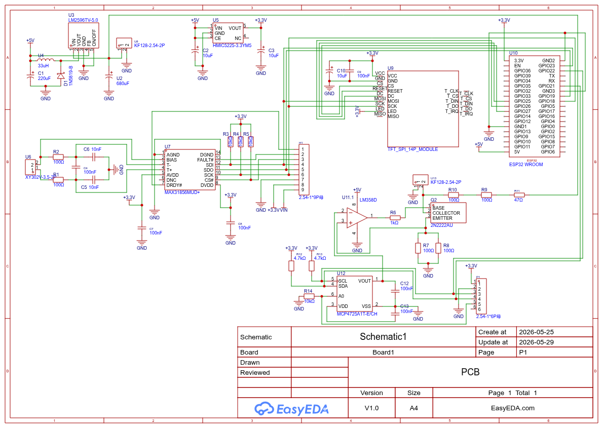

# ESP32 Industrial Temperature Transmitter (4-20mA Loop)



## Overview
This repository contains the hardware design and firmware implementation for an industrial-grade temperature transmitter. The system acquires high-precision thermal data using a thermocouple paired with a **MAX31856** precision converter, processes the signal through an **ESP32** microcontroller, and drives an analog output using an **MCP4725** DAC coupled to a robust **4-20mA current loop**.

Designed with industrial instrumentation standards in mind, this board serves as a reliable physical plant for advanced control systems validation and laboratory experimentation.

## Key Hardware Features
* **Precision Acquisition:** Cold-junction compensated thermocouple reading (MAX31856) via SPI.
* **Analog Output:** 12-bit DAC (MCP4725) communicating via I2C.
* **Current Loop:** Standard 4-20mA transmission using an LM358 Op-Amp and a 2N2222 SMD BJT for thermal stability.
* **Noise Immunity:** Strict PCB layout rules including isolated analog and digital ground planes (GND) tied at a single star point, and dedicated low-pass capacitive filtering for the analog signal path.
* **SMT Manufacturing:** Fully assembled using Pick & Place robotics for surface-mount components, ensuring signal integrity.

## Repository Structure
```text
├── Hardware/          # KiCad/EasyEDA source files, BOM, CPL, and Gerbers
├── Firmware/          # ESP32 C/C++ source code (Sensor reading & DAC control)
├── Docs/              # Mathematical modeling and control block diagrams
└── README.md          # Project documentation
